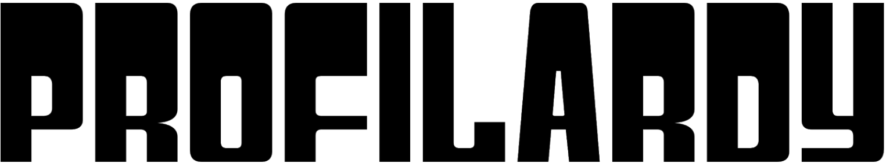
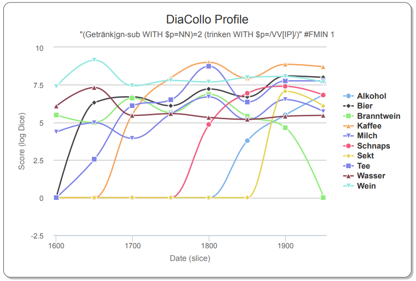
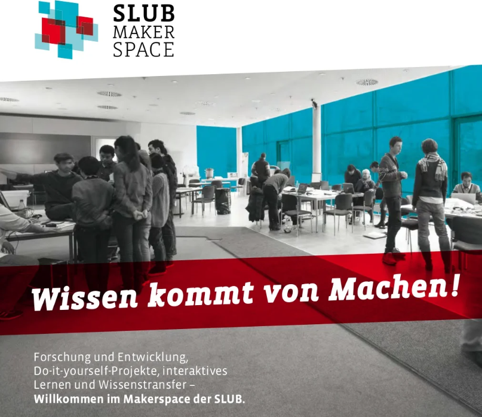

layout: true
  
<div class="my-header"></div>

<div class="my-footer">
  <table>
    <tr>
      <td style="text-align:right">Sächsische Landesbibliothek – Staats- und Universitätsbibliothek</td>
      <td>27. Januar 2025</td>
      <td style="text-align:right"><a href="https://www.slub-dresden.de/">www.slub-dresden.de</a></td>
    </tr>
    <tr>
      <td style="text-align:right">Referat Forschungsnahe Services</td>
      <td />
    </tr>
  </table>
</div>

<div class="my-title-footer">
  <table>
    <tr>
      <td style="text-align:left"><b>Kay-Michael Würzner</b></td>
    </tr>
    <tr>
      <td style="text-align:left">Referat Open Science</td>
    </tr>
    <tr>
      <td style="font-size:8pt"><b>27. Januar 2025</b></td>
    </tr>
    <tr>
      <td style="font-size:8pt">Vorlesung <i>Information Retrieval</i></td>
    </tr>
  </table>
</div>

---

class: title-slide
count: false

# Vom Textobjekt über digitale Volltexte zu Forschungsdaten
## Digitalisierung, Annotation und Analyse

---

# Überblick

- vom Textobjekt zum maschinenlesbaren Volltext
    + am Beispiel Optical Character Recognition
- vom maschinenlesbaren Volltext zum Forschungsdatum in der quantitativen Korpuslinguistik
    + mit Hilfe automatischer Annotation zur quantitative Textanalyse

---

class: part-slide
count: false

# Etappe 1: vom Textobjekt zum maschinenlesbaren Volltext

---

# Belege als Forschungsgrundlage

.cols[
.fourty[
- empirische Forschung → Belege
]
.sixty[
]
]

---

count: false

# Belege als Forschungsgrundlage

.cols[
.fourty[
- empirische Forschung → Belege
]
.sixty[
<p style="margin-top:-20px">
<br />
<a style="font-size:8pt" href="https://commons.wikimedia.org/wiki/File:Gneis2.jpg">Bild: Grabenstedt (CC-Attribution SA 3.0 Unported)</a>
</p>
]
]

---

count: false

# Belege als Forschungsgrundlage

.cols[
.fourty[
- empirische Forschung → Belege
]
.sixty[
<p style="margin-top:-20px">

</p>
]
]

---

count: false

# Belege als Forschungsgrundlage

.cols[
.fourty[
- empirische Forschung → Belege
]
.sixty[
<p style="margin-top:-20px">

</p>
]
]

---

count: false

# Belege als Forschungsgrundlage

.cols[
.fourty[
- empirische Forschung → Belege
]
.sixty[
<p style="margin-top:-20px">

</p>
]
]

---

count: false

# Belege als Forschungsgrundlage

.cols[
.fourty[
- empirische Forschung → Belege
- Textdokumente als prominente Belegquelle
    + Linguistik
    + Geschichte
    + Recht
    + Philosophie
    + ...
]
.sixty[
<p style="margin-top:-20px">

</p>
]
]

---

count: false

# Belege als Forschungsgrundlage

.cols[
.fourty[
- empirische Forschung → Belege
- Textdokumente als prominente Belegquelle
    + Linguistik
    + Geschichte
    + Recht
    + Philosophie
    + ...
- zentrale Grundlage der **digitalen Geisteswissenschaften**
]
.sixty[
<p style="margin-top:-20px">

</p>
]
]

---

# Textdokumente als Belegquelle

- Vorteile
    + in großem Umfang verfügbar
    + systematisch gesammelt
    + einfach reproduzierbar
    + leicht zu lesen
    + **relativ einfach digitalisierbar**
- *Korpora*: repräsentative Erfassung einer Sprache, eines Sprachstandes, eines speziellen Ausschnitts einer Sprache
    + Referenzkorpora
        * British National Corpus [(Leech 1992)](https://hdl.handle.net/10371/85926)
            * Deutsches Textarchiv [(Geyken et al. 2011)](http://www.hbz-nrw.de/dokumentencenter/veroeffentlichungen/Tagung_Digitale_Wissenschaft.pdf#page=159)
    + Spezialkorpora
        * *childLex* [(Schroeder et al. 2014)](https://link.springer.com/article/10.3758/s13428-014-0528-1)
        * Internetblogs [(Barbaresi und Würzner 2015)](https://edoc.bbaw.de/opus4-bbaw/frontdoor/index/index/docId/2330)
        * *Berliner Wendekorpus* [(Dittmar und Paul 2019)](https://ids-pub.bsz-bw.de/frontdoor/deliver/index/docId/9349/file/Dittmar_Paul_Sprechen_im_Umbruch_2019.pdf)

---

# Dokumenttypen

- **Problem**: viele Dokumente nicht grundständig digital verfügbar
- **Problem**: Digitalisierung ⇏ Texterfassung

<center>

</center>

---

# Dokumenttypen

- **Problem**: viele Dokumente nicht grundständig digital verfügbar
- **Problem**: Digitalisierung ⇏ Texterfassung

<center>

</center>

---

# Dokumenttypen

- **Problem**: viele Dokumente nicht grundständig digital verfügbar
- **Problem**: Digitalisierung ⇏ Texterfassung

<center>
<br />
<a style="font-size:8pt" href="https://commons.wikimedia.org/wiki/File:170423-Einkaufszettel-01.jpg">Bild: BlueBreezeWiki (CC-BY-SA 3.0)</a>
</center>

---

# Dokumenttypen

- **Problem**: viele Dokumente nicht grundständig digital verfügbar
- **Problem**: Digitalisierung ⇏ Texterfassung

<center>
<br />
<a style="font-size:8pt" href="https://de.wikipedia.org/wiki/Datei:Teibert_Whitecaps_Interview.jpg">Bild: betancourt (CC-BY 2.0)</a>
</center>

---

# Fokus: Texterfassung per OCR

.cols[
.sixty[
- Bilderfassung ≠ Texterfassung
- **O**ptical **C**haracter **R**ecognition: Automatische Erfassung von Text in Bildern
- ursprünglich begrenzt auf Zeichenerkennung
- heute häufig Synonym für den gesamten Texterfassungsprozess
  + Bildvorverarbeitung
  + Layoutanalyse (OLR)
  + Zeilenerkennung
  + ...
]
.fourty[
<center></center>
]
]

---

# Komponenten eines einfachen OCR-Workflows

.cols[
.fifty[
]
.fourty[
<p style="margin-top:-80px">

</p>
]
]

---

count: false

# Komponenten eines einfachen OCR-Workflows

.cols[
.fifty[
- Bildvorverarbeitung
]
.fourty[
<p style="margin-top:-80px">

</p>
]
]

---

count: false

# Komponenten eines einfachen OCR-Workflows

.cols[
.fifty[
- Bildvorverarbeitung
]
.fourty[
<p style="margin-top:-80px">

</p>
]
]

---

count: false

# Komponenten eines einfachen OCR-Workflows

.cols[
.fifty[
- Bildvorverarbeitung
- Layoutanalyse
]
.fourty[
<p style="margin-top:-80px">

</p>
]
]

---

count: false

# Komponenten eines einfachen OCR-Workflows

.cols[
.fifty[
- Bildvorverarbeitung
- Layoutanalyse
]
.fourty[
<p style="margin-top:-80px">

</p>
]
]

---

count: false

# Komponenten eines einfachen OCR-Workflows

.cols[
.fifty[
- Bildvorverarbeitung
- Layoutanalyse
    * **strukturierende** Elemente
        + Absätze
        + Überschriften
]
.fourty[
<p style="margin-top:-80px">

</p>
]
]

---

count: false

# Komponenten eines einfachen OCR-Workflows

.cols[
.fifty[
- Bildvorverarbeitung
- Layoutanalyse
    * **strukturierende** Elemente
        + Absätze
        + Überschriften
    * **textflussunterbrechende** Elemente
        + Seitenzahlen
        + Kolumnentitel
        + Abbildungsunterschriften
        + Marginalien etc.
]
.fourty[
<p style="margin-top:-80px">

</p>
]
]

---

count: false

# Komponenten eines einfachen OCR-Workflows

.cols[
.fifty[
- Bildvorverarbeitung
- Layoutanalyse
    * **strukturierende** Elemente
        + Absätze
        + Überschriften
    * **textflussunterbrechende** Elemente
        + Seitenzahlen
        + Kolumnentitel
        + Abbildungsunterschriften
        + Marginalien etc.
    * **nichttextuelle** Elemente
        + Abbildungen
        + Tabellen etc.
]
.fourty[
<p style="margin-top:-80px">

</p>
]
]

---

count: false

# Komponenten eines einfachen OCR-Workflows

.cols[
.fifty[
- Bildvorverarbeitung
- Layoutanalyse
    * **strukturierende** Elemente
        + Absätze
        + Überschriften
    * **textflussunterbrechende** Elemente
        + Seitenzahlen
        + Kolumnentitel
        + Abbildungsunterschriften
        + Marginalien etc.
    * **nichttextuelle** Elemente
        + Abbildungen
        + Tabellen etc.
- Texterkennung
]
.fourty[
<p style="margin-top:-80px">

</p>
]
]

---

# Texterkennung: Zeichenorientierte Ansätze

.cols[
.seventy[
- Erkennung erfolgt *glyphenweise*
  - **Mustervergleich**: Vergleich der Zeichenbilder zu in einem „Setzkasten“ gespeicherten Glyphen **Pixel für Pixel**
  - **Merkmalsvergleich**: Zerlegung der Glyphen in vordefinierte, bedeutungstragende **Eigenschaften** wie *Einfärbung*, *Kurven*, *Linien* etc. und Vergleich zu Referenzmaterialien
]
.fourty[
<center></center>
]
]

---

count: false

# Texterkennung: Zeichenorientierte Ansätze

.cols[
.seventy[
- Erkennung erfolgt *glyphenweise*
  - **Mustervergleich**: Vergleich der Zeichenbilder zu in einem „Setzkasten“ gespeicherten Glyphen **Pixel für Pixel**
  - **Merkmalsvergleich**: Zerlegung der Glyphen in vordefinierte, bedeutungstragende **Eigenschaften** wie *Einfärbung*, *Kurven*, *Linien* etc. und Vergleich zu Referenzmaterialien
]
.fourty[
<center></center>
]
]
- *regelbasiertes Vorgehen*
    + **direkte** Abbildung von Referenzmaterial
    + Modellierung von Expertenwissen
- Zerlegung der Seite in *Zeilen* und *Zeichen* notwendig

---

# Texterkennung: Zeilenorientierte Ansätze

- Erkennung erfolgt *zeilenweise*
  1. **Skalierung:** einheitliche Höhe für alle Zeilen
  2. **Merkmalsextraktion**: Raster mit festgelegter Anzahl (horizontaler) Zeilen und variabler Anzahl (vertikaler) Spalten → Zeilen als Sequenzen binärwertiger Vektoren fixer Länge
<center></center>
- kontextsensitive Erkennung über *Übergangswahrscheinlichkeiten* der Vektoren
- Zerlegung der Seite in *Zeilen* notwendig
- Vorgehen robuster gegenüber Varianz durch Artefakte als zeichenorientierte Ansätze
- `Tesseract` (ab Version 4), `OCRopus`, `kraken`, `Calamari`
  + Einsatz *neuronaler Netze* für die Sequenzklassifikation

---

# Texterkennung: Zeilenorientierte Ansätze

- Sequenzierung per Vektorisierung
    + **Skalierung** auf einheitliche Höhe
    + **Unterteilung** in 1pixel-breite Streifen

<center>

</center>
<center>
<p>↓</p>
</center>
<center>

</center>

---

# Texterkennung: Zeilenorientierte Ansätze

- Tabelle mit fester Anzahl Zeilen und variabler Anzahl Spalten
- schwarze (1) und weiße (0) Pixel
    + **endliche Anzahl** mgl. Belegungen
- charakteristische Abfolge pro Zeichen (und Wort)

<center>

</center>
<center>
<p>↓</p>
</center>
<center>

</center>

---

# Exkurs: Sequenzklassifikation

- zentrales Verfahren des maschinellen Lernens (cf. e.g. [Xing et al. 2010](https://www.cs.sfu.ca/~jpei/publications/Sequence%20Classification.pdf))
- basierend auf dem **Satz von Bayes**: `\(P(C|E) = \frac{P(E|C)\cdot P(C)}{P(E)}\)`
- Rezept
    + Man nehme
        * eine **sehr große** Liste **manuell annotierter** Daten und
        * einen **Trainingsalgorithmus**,
    + modelliere eine **`m:n`-Beziehung** zwischen Eingabe und Ausgabe,
        * e.g., jeder Buchstabe wird auf eine Klasse abgebildet
        * e.g., jeder Pixelstreifen wird auf einen Buchstaben abgebildet
        * e.g., jedes Wort wird auf eine Wortklasse abgebildet
    + induziere ein **statistisches Modell**,
    + und evaluiere dessen Qualität anhand von **Evaluationsdaten**

---

# Exkurs: Sequenzklassifikation

- Illustration am Beispiel Worttrennung
    + Daten
        * http://de.wiktionary.org
        * Worttrennungsangaben für > 250 000 deutsche Wörter
        * `Elektrik ↦ Elek·t·rik`

---

count: false

# Exkurs: Sequenzklassifikation

- Illustration am Beispiel Worttrennung
    + Daten
        * http://de.wiktionary.org
        * Worttrennungsangaben für > 250 000 deutsche Wörter
        * `Elektrik ↦ Elek·t·rik`
    + Kodierung `\(f: \Sigma\rightarrow\mathbb{B}\)` 
      $$
      f(x) = \begin{cases} 1 & x\,\text{gefolgt von Trennstelle} \\\\
      0 & \, \text{sonst}\end{cases}
      $$ 
      ```
      E l e k t r i k
      0 0 0 1 1 0 0 0
      ```

---

count: false

# Exkurs: Sequenzklassifikation

- Illustration am Beispiel Worttrennung
    + Daten
        * http://de.wiktionary.org
        * Worttrennungsangaben für > 250 000 deutsche Wörter
        * `Elektrik ↦ Elek·t·rik`
    + Kodierung `\(f: \Sigma\rightarrow\mathbb{B}\)` 
      $$
      f(x) = \begin{cases} 1 & x\,\text{gefolgt von Trennstelle} \\\\
      0 & \, \text{sonst}\end{cases}
      $$ 
      ```
      E l e k t r i k
      0 0 0 1 1 0 0 0
      ```
    + Training
        * Zählen von Sequenzen aus Eingabe-Ausgabe-Paaren
        * Berechnung bzw. Schätzung einer Wahrscheinlichkeitsverteilung
        * Repräsentation als statistisches Modell (**H**idden **M**arkov **M**odel, **C**onditional **R**andom **F**ield, **N**euronales **N**etz)

---

# Exkurs: Sequenzklassifikation

- einfacher aber wirkungsvoller Algorithmus für Anwendungen in
    + Sprachverarbeitung, e.g.
        * Tokenisierung (Zeichen → Wortgrenzen)
        * Wortartenerkennung (Wörter → Wortarten)
        * Textklassifikation (Texte → Textsorten, `n:1`-Problem)
    + Bioinformatik, e.g.
        * Proteinklassfizierung in DNA-Sequenzen (Nukleinbasen → Aminosäuren)
    + Bildverarbeitung, e.g.
        * Layouterkennung (Pixel → Layoutelemente)
        * **Texterkennung** (Pixelvektoren → Buchstaben)
- unzählige gute (Python-)Tutorials vefügbar, e.g.
    + [Wortartenerkennung mit CRFs](https://albertauyeung.github.io/2017/06/17/python-sequence-labelling-with-crf.html/)
    + [DNA-Sequenzierung mit HMMs](https://github.com/jmschrei/pomegranate/blob/master/tutorials/B_Model_Tutorial_3_Hidden_Markov_Models.ipynb)
    + [Stimmungsbewertung in Filmkritiken mit NNs](https://machinelearningmastery.com/sequence-classification-lstm-recurrent-neural-networks-python-keras/)

---

# Texterkennung: Zeilenorientierte Ansätze

- Übertragung auf OCR
    + Daten
        * https://htr-united.github.io/
        * manuell transkribierte Textzeilen
    + Kodierung `\(f: \mathbb{N}^{10}\rightarrow\mathbb{B}\)` 
      $$
      f(x[n]) = \begin{cases} 1 & \text{Pixel in Zelle $(x,n)$ schwarz} \\\\
      0 & \, \text{sonst}\end{cases}
      $$ 
    + Training
        * Zählen von Sequenzen aus Vektor-Buchstabenteil-Paaren
        * Repräsentation als OCR-Modell
        * Tesseract: [tesstrain](https://github.com/tesseract-ocr/tesstrain)
.cols[
.fifty[
```
  0123456789
0 1111111111
2 0000110000 
```
]
.fifty[
<center>

</center>
]
]

---

# Texterkennung: Werkzeuge

- Software
    + [**Tesseract**](https://github.com/tesseract-ocr/tesseract): komplettes Open-Source-Paket
        * regelbasierte Bildvorverarbeitung und Layouterkennung
        * datengetriebene Texterkennung (unterstützt > 100 Sprachen)
        * Ease-of-Use-Training eigener Modelle
        * für OCR und **HTR** verwendbar
    + [**OCRopy**](https://github.com/ocropus/ocropy): umfangreiches Open-Source-Paket
        * regelbasierte Bildvorverarbeitung und Layouterkennung
        * datengetriebene Texterkennung (nur sehr wenige Modelle vorhanden)
        * für OCR und **HTR** verwendbar
        * prominente Ableger: [**kraken**](https://kraken.re) und [**Calamari**](https://github.com/Calamari-OCR/calamari)
    + [**OCR-D**](https://ocr-d.de/): Workflow-Engine
        * Orchestrierung verschiedener Open-Source-Pakete zu stabilen Workflows
        * gleichzeitig DFG-Förderprogramm zur Verbesserung von OCR für historische Drucke
        * SLUB als maßgebliche Entwicklungseinrichtung

---

# Texterkennung: Tesseract

- mit großem Abstand: verbreitetste OCR-Software
    + Einsatz in unzähligen Apps, Forschungsprojekten, privaten Kontexten
- kostenlos verwendbar, quelloffen entwickelt
<center></center>
- Lizenzmodell erlaubt kommerziellen Einsatz
    + (Teil-)Grund für Erfolg?

---

# Texterkennung: Tesseract

- Teil praktisch aller **Linux**distributionen
    + Installation auf MacOS per `Homebrew` und `MacPorts` möglich
    + Installation unter Windows per [Installer](https://github.com/UB-Mannheim/tesseract/wiki) möglich
- Zugriff auf Tesseract per
    + Programmierschnittstelle (API)
    + **Kommandozeilenschnittstelle** (CLI)
    + graphische Benutzeroberfläche (GUI, Drittanbieter)
- Erkennunsgmodelle für zahlreiche Sprachen bzw. Schriften vorhanden
    + teilweise als installierbare Pakete
    + empfehlenswert jedoch Download von [GitHub](https://github.com/tesseract-ocr/tessdata_best)

---

# Texterkennung: Tesseract

- Prinzipielle Kommandostruktur
```
tesseract EINGABEBILD AUSGABE (OPTIONEN) (AUSGABEKONFIGURATION)
```
- einfachster Aufruf
```
$ tesseract sample.png -
```
    + `-` schickt die Ergebnisse nach `stdout`
    + Modell `eng` per default ausgewählt
    + Konfiguration `txt` per default ausgewählt

.cols[
.sixty[
```
The Quick Brown
Fox Jumps Over
The Lazy Dog
```
]
.fourty[
<center>

<p style="font-size:4pt;">Image by Peter J. Acklam, public domain</p>
</center>
]
]

---

# Texterkennung: Tesseract

- Modellauswahl
    + Option `-l MODELLNAME`, Datei `MODELLNAME.traineddata` nötig
    + eventuell in Kombination mit `--tessdata-dir`
    + Kombination mehrerer Modelle möglich:
      `-l MODELLNAME+MODELLNAME2+MODELLNAME3`
- Segmentierung
    + Option `-psm MODUS` (Liste verfügbarer Optionen via `--help-psm`)
    + Möglichkeit einzelne Absätze, Zeilen oder gar Wörter zu verarbeiten
- Bildauflösung
    + wichtiger Faktor für Ergebnisqualität
    + idealerweise min. 300 dpi
    + unter Umständen Teil der Metadaten, anonsten: `Warning: Invalid resolution 0 dpi. Using 70 instead.`
    + manuell per `--dpi` setzbar

---

# Exkurs: LLMs

.cols[
.sixty[
- OCR mit LLMs gut und gleichzeitig fehleranfällig
    + eingeschränkte Trainingsmöglichkeiten
    + end-to-end vs. modular einsetzbare Werkzeuge
- OCR-Nachkorrektur mit LLMs sehr vielversprechend
    + Text-zu-Text als „Basisklassifikation“
    + datensparsame Überarbeitung existierender Volltexte
    + diverse Textspezialisierungen mgl.
]
.fourty[
<center>

<p style="font-size:4pt;">Image by [Wannapik](https://www.wannapik.com/vectors/25379), CC-BY-NC 4.0</p>
</center>
]
]

---

class: part-slide
count: false

# Etappe 2: vom maschinenlesbaren Volltext zum Forschungsdatum in der quantitativen Korpuslinguistik

---

# Vom Beleg zu dessen Beforschung


- systematische Auswertung von Textkorpora
- **Close reading**: eigentlich grundlegende Methode der Literaturwissenschaft
- seit Franco Morretti (2005) *Graphs, Maps, Trees*: Gegenüberstellung (manueller) *Einzelbelegauswertung* und
der (automatischen) *Analyse großer Textmengen* (**Distant Reading**):
> ... a little pact with the devil: we know how to read texts, now let’s learn how not to read them.
- Erkenntnisgewinn durch **quantitative Textanalyse** ein großes Versprechen der *Digital Humanities*

---

# Vom Beleg zu dessen Beforschung

.center[]

---

# Vom Beleg zu dessen Beforschung

.center[]

---

# Vom Beleg zu dessen Beforschung

.center[]

---

# Linguistische Annotation

- Aufgabe:
    + Auszeichnung bestimmter linguistischer Eigenschaften
    + Strukturierung und Anreicherung der Rohtexte
        * bessere Durchsuchbarkeit
        * einfachere Belegidentifikation
        * moderne Korpuspräsentationsformen
        * **quantitative Auswertungen**


| Beispiel | | | | | |
|------|----------|--------|-------|-------------|-------------------|
| Rohtext | *Aerzte* | *ſind* | *des* | *HERRgotts* | *Menſchenflikker* |
| Normalisiert | *Ärzte* | *sind* | *des* | *Herrgotts* | *Menschenflicker* |
| Lemma | *Arzt* | *sein* | *die* | *Herrgott* | *Menschenflicker* | 
| Tag | `NN` | `VAFIN` | `ART` | `NN` | `NN` |
| Grammatik | `Subjekt` | `Prädikat` | `Objekt` | `Objekt` | `Objekt` |

---

# Linguistische Annotation im Alltag

<center>

</center>

---

# Linguistische Annotation

- Analysekette:
    + Zerlegung des Fließtextes in Wörter und Sätze: **Tokenisierung**
    + Bestimmung mgl. Grundformen der Wörter: **Lemmatisierung**
    + (Normalisierung von Schreibungsvarianten: **Kanonisierung**)
    + Bestimmung der tatsächlichen Wortart eines Wortes: **PoS-Tagging**
    + Klassifizierung der Beziehungen der Wörter untereinander: **Dependenzparsing**
    + Auszählen gemeinsamer Vorkommen von Wörtern bzw. Wortgruppen: **distributionelle Semantik**
- vollautomatisch möglich (mit akzeptabler Qualität)
- zwei grundsätzliche Ansätze der Modellierung:
    + auf Basis manuell erstellter Beispiele **automatisch** induzierte Regeln
    + auf Basis von Expertenwissen **manuell** erstellte Regeln

---

# Exkurs: regelbasierte Modellierung

- grundsätzliches Vorgehen der sog. *künstlichen Intelligenz* bis zum Informationszeitalter
    + Hauch der Unwissenschaftlichkeit statistischer Verfahren
    + besonders in der Sprachwissenschaft:
    > It's true there's been a lot of work on trying to apply statistical models to various linguistic problems. I think there have been some successes, but a lot of failures. There is a notion of success ... which I think is novel in the history of science. It interprets success as approximating unanalyzed data. ([Chomsky 2011](https://www.youtube.com/watch?v=jgbCXBJTpjs))
- Ziel Verständnis über kognitive Prozesse und die Entwicklung eines über Module hinweg interagierenden Gesamtkonstrukts menschlicher Sprachverarbeitung

---

# Exkurs: regelbasierte Modellierung

- Beispiel *morphologische Analyse*
    + Bestimmung der **möglichen** Wortarten eines Wortes
      ```
      grünen ↦ {Verb, Adjektiv}
      Müller ↦ {Substantiv, Eigenname}
      ```
    + Abbildung auf eine kanonische **Grundform** (*Lemma*)
      ```
      grünen  ↦ grün
      Müllers ↦ Müller
      ```
    + Identifikation der beteiligten Wortbildungsprozesse
      ```
      Grünspan ↦ grün<A>#Span<N>
      verirren ↦ ver<p>+irren<V>
      ```
- Verfahren des maschinellen Lernens (bisher) nicht geeignet (cf. e.g. [McCarthy et al. 2019](https://aclanthology.org/W19-4226v3.pdf))

---

# Exkurs: regelbasierte Modellierung

- herausfordernd für Sprachen mit komplexer Wortbildung (Kompetenz!)
    + (mentales) Lexikon unendlicher Größe
        * Dampfschifffahrtsgesellschaftskapitän
        * Dampfschifffahrtsgesellschaftskapitänsmütze
    + Belege? **Oftmals Fehlanzeige**
- simple, beschreibende Regel: `NN → NN NN`
- implementiert als `Finite State Morphology` [(Beesley und Karttunen 2003)](https://web.stanford.edu/~laurik/fsmbook/home.html)
    + man nehme
        * eine **große** Liste einfacher Wörter
        * deren **morphosyntaktische** Eigenschaften
        * Vor- und Nachsilben,
    + packe dies in einen **endlichen Automaten** und
    + bilde dessen **Kleenesche Hülle**

---

# Exkurs: regelbasierte Modellierung

- endlicher Automat: `\(\mathcal{A}=\{\Sigma,\Delta,Q,q_0,F,E\}\)`
    + `\(\Sigma,\Delta\ldots\)` Ein- bzw. Ausgabealphabet
    + `\(Q\ldots\)` Zustände, `\(F\subseteq Q\ldots\)` Endzustände, `\(q_0\in Q\ldots\)` Startzustand
    + `\(E\ldots\)` Übergänge `\(\langle e_k, e_l, a, b\rangle\)`
- Illustration `Finite State Morphology`
    + Lexikon `{schön<A>,Geist<N>}`
    + Vorsilben `{un<p>,ur<p>}`
    + Nachsilben `{heit<N>,lich<A>}`

<center></center>

---

count: false

# Exkurs: regelbasierte Modellierung

- endlicher Automat: `\(\mathcal{A}=\{\Sigma,\Delta,Q,q_0,F,E\}\)`
    + `\(\Sigma,\Delta\ldots\)` Ein- bzw. Ausgabealphabet
    + `\(Q\ldots\)` Zustände, `\(F\subseteq Q\ldots\)` Endzustände, `\(q_0\in Q\ldots\)` Startzustand
    + `\(E\ldots\)` Übergänge `\(\langle e_k, e_l, a, b\rangle\)`
- Illustration `Finite State Morphology`
    + Lexikon `{schön<A>,Geist<N>}`
    + Vorsilben `{un<p>,ur<p>}`
    + Nachsilben `{heit<N>,lich<A>}`

<center></center>

---

count: false

# Exkurs: regelbasierte Modellierung

- endlicher Automat: `\(\mathcal{A}=\{\Sigma,\Delta,Q,q_0,F,E\}\)`
    + `\(\Sigma,\Delta\ldots\)` Ein- bzw. Ausgabealphabet
    + `\(Q\ldots\)` Zustände, `\(F\subseteq Q\ldots\)` Endzustände, `\(q_0\in Q\ldots\)` Startzustand
    + `\(E\ldots\)` Übergänge `\(\langle e_k, e_l, a, b\rangle\)`
- Illustration `Finite State Morphology`
    + Lexikon `{schön<A>,Geist<N>}`
    + Vorsilben `{un<p>,ur<p>}`
    + Nachsilben `{heit<N>,lich<A>}`

<center></center>

---

count: false

# Exkurs: regelbasierte Modellierung

- endlicher Automat: `\(\mathcal{A}=\{\Sigma,\Delta,Q,q_0,F,E\}\)`
    + `\(\Sigma,\Delta\ldots\)` Ein- bzw. Ausgabealphabet
    + `\(Q\ldots\)` Zustände, `\(F\subseteq Q\ldots\)` Endzustände, `\(q_0\in Q\ldots\)` Startzustand
    + `\(E\ldots\)` Übergänge `\(\langle e_k, e_l, a, b\rangle\)`
- Illustration `Finite State Morphology`
    + Lexikon `{schön<A>,Geist<N>}`
    + Vorsilben `{un<p>,ur<p>}`
    + Nachsilben `{heit<N>,lich<A>}`

<center></center>

---

count: false

# Exkurs: regelbasierte Modellierung

- endlicher Automat: `\(\mathcal{A}=\{\Sigma,\Delta,Q,q_0,F,E\}\)`
    + `\(\Sigma,\Delta\ldots\)` Ein- bzw. Ausgabealphabet
    + `\(Q\ldots\)` Zustände, `\(F\subseteq Q\ldots\)` Endzustände, `\(q_0\in Q\ldots\)` Startzustand
    + `\(E\ldots\)` Übergänge `\(\langle e_k, e_l, a, b\rangle\)`
- Illustration `Finite State Morphology`
    + Lexikon `{schön<A>,Geist<N>}`
    + Vorsilben `{un<p>,ur<p>}`
    + Nachsilben `{heit<N>,lich<A>}`

<center></center>

---

count: false

# Exkurs: regelbasierte Modellierung

- endlicher Automat: `\(\mathcal{A}=\{\Sigma,\Delta,Q,q_0,F,E\}\)`
    + `\(\Sigma,\Delta\ldots\)` Ein- bzw. Ausgabealphabet
    + `\(Q\ldots\)` Zustände, `\(F\subseteq Q\ldots\)` Endzustände, `\(q_0\in Q\ldots\)` Startzustand
    + `\(E\ldots\)` Übergänge `\(\langle e_k, e_l, a, b\rangle\)`
- Illustration `Finite State Morphology`
    + Lexikon `{schön<A>,Geist<N>}`
    + Vorsilben `{un<p>,ur<p>}`
    + Nachsilben `{heit<N>,lich<A>}`

<center></center>

---

# Exkurs: regelbasierte Modellierung

- Herausforderungen
    + Übergenerierung (z.B. *Geistgeist*)
    + Regressionen (z.B. *Bonbon*)
    + Komplexität, z.B. TAGH [(Geyken und Hanneforth 2005)](https://www.dwds.de/dwds_static/publications/text/Geyken_Hanneforth_fsmnlp.pdf)
        * 1&#x202f;864&#x202f;991 Lexikoneinträge
        * 7&#x202f;678 Vorsilben
        * 1&#x202f;073 Nachsilben
        * 2&#x202f;679&#x202f;741 Zustände
    + Aufwand in Erstellung und Pflege
- implizites vs. explizites Wissen

---

# Linguistische Annotation

.cols[
.fifty[
- Verdichtung, e.g.
    + Flexion
    + Schreibungsvariation
    + für höhere **quantitative Aussagekraft**
- Diskriminierung
    + Ambiguitäten, z.B. bzgl. Wortart
    + für höhere **qualitative Aussagekraft**
- Hilfsmittel für **sauber(er)e Analysen**
]
.fifty[
- auch auf anderen Ebenen (Phonologie, Syntax, formale Semantik)
    + Grammatiken, Parser
    + *Chomsky-Hierarchie* (u.a. [Chomsky 1959](https://www.sciencedirect.com/science/article/pii/S0019995859903626))

]
]

---

# Linguistische Annotation: Werkzeuge

- zwei wichtige Python-Bibliotheken
    * `NLTK`: Sammlung vieler verschiedener Referenzimplementierungen **und** -Modellen
        + begleited von (offenem) Lehrbuch: https://www.nltk.org/book/
        + trainierbar
    * `spaCy`: ein Tool pro Annotationsschritt auf Basis neuronaler Netze
        + Modelle für viele Sprachen
        + trainierbar
```python
import spacy
nlp = spacy.load("en_core_web_sm")
phrase = nlp("The old man the boat")
for token in phrase
  print(token.pos, token.lemma_)
```

---

# Distributionelle Semantik

- Semantik: Theorie von der sprachlichen Bedeutung
    + **lexikalische** Semantik: Wortbedeutungen
    + **kompositionelle** Semantik: Phrasen- und Satzbedeutung
    * **ontologische** Beziehungen: Synonyme, Hyponyme, Hyperonyme
- mit automatischen Verfahren erfassbar
- distributionelle Ähnlichkeit: gleiche Kontexte ⇒ ähnliche Bedeutung
> You shall know a word by the company it keeps.
> [(Firth 1957)](https://cs.brown.edu/courses/csci2952d/readings/lecture1-firth.pdf)
    + `Er versenkte den .... im Tor.`

---

count: false

# Distributionelle Semantik

- Semantik: Theorie von der sprachlichen Bedeutung
    + **lexikalische** Semantik: Wortbedeutungen
    + **kompositionelle** Semantik: Phrasen- und Satzbedeutung
    * **ontologische** Beziehungen: Synonyme, Hyponyme, Hyperonyme
- mit automatischen Verfahren erfassbar
- distributionelle Ähnlichkeit: gleiche Kontexte ⇒ ähnliche Bedeutung
> You shall know a word by the company it keeps.
> [(Firth 1957)](https://cs.brown.edu/courses/csci2952d/readings/lecture1-firth.pdf)
    + `Er versenkte den Ball im Tor.`

---

# Distributionelle Semantik

- Vorgehen:
    + Man definiere einen **Kontext** (z.&#x202f;B. Satz) und **interessante** Wörter,
    + werfe für jedes Zielwort alle interessanten Wörter (z.&#x202f;B. *Nomen* und *Verben*) aus dem Kontext in einen Topf (*Bag of Words*),
    + repräsentiere den Topf als **hochdimensionalen Vektorraum** und
    + vergleiche die Vektoren miteinander.
- Illustration:
    + `Der Säufer randalierte in der Kneipe. Die Polizei sperrte den Säufer ein, weil er randalierte.`
.right[]

---

# Distributionelle Semantik

- **Kollokation**: häufiges gemeinsames Auftreten zweier Wörter in vordefiniertem Kontext 
    + enge semantische Beziehungen (*Schüler* → *Lehrer*) 
    + Sachverhalte (*Schule* → *Reform*) 
    + feste Phrasen (*Hänschen* → *Hans*)
- **Annäherungen an die Verwendung eines Begriffes:**
    + Ermittlung aller Kollokationen eines Eingabebegriffes
    + Ordnung nach deren Assoziationsgrad zum Eingabebegriff
    + Beispiel [*Begriff*](https://kaskade.dwds.de/dstar/dta/diacollo/?query=Begriff&_s=submit&date=&slice=0&score=ld&kbest=10&cutoff=&profile=2&format=html&global=1&groupby=&eps=0) im DTA

---

# Distributionelle Semantik

<center>

</center>

.center[**↓**]

<center>

</center>

<center>
<a href="https://docs.google.com/presentation/d/1qPfvBRmpPNAV6Y3zHGoYXAj-MuKy84E1ZJPvgMjwezA/edit?usp=sharing"><b>Klick mich!</b></a>
</center>

---

# Distributionelle Semantik

.cols[
.fifty[
- **Spezifische Verwendung von Begriffen**:
    + Diskriminierung von Kollokationen bzgl. syntaktischer Konstruktionsmuster
    + `Kollokationen + Konstruktionsmuster = Wortprofil` <a href="https://pub.ids-mannheim.de/laufend/opal/pdf/opal2014-2.pdf#page=39">(Didakowski und Geyken 2014)</a>
    + z.B. *verkünden* vs. *bekanntgeben*
]
.fifty[

]]

---

# Distributionelle Semantik
.cols[
.fifty[
<p/>
<a href="https://www.deutschestextarchiv.de/files/jw2017diacollo.pdf" style="font-size:1.1rem">(Jurish und Werneke 2017)</a>
]
.fifty[
- **Annäherung an Bedeutungswandel eines Begriffes**:
    + Ermittlung aller Kollokationen eines Eingabebegriffes **in definierten Zeitintervallen**
    + `Kollokationen + Verlauskurven = DiaCollo` <a href="https://www.deutschestextarchiv.de/files/jurish2015diacollo-clarin.pdf">(Jurish 2015)</a>
]]

---

# Textbelege als Forschungsdaten

Vorgehensweise

- *explorativ*
  + Wordstatistiken und Verlaufskurven
  + signifikante Veränderungen im Inhaltswortbereich
  + Hinweise auf Bedeutungsverschiebung bzw. Bezeichnungswandel

- *hypothesengeleitet*
  + spezifische Korpusrecherchen zur effizienten Belegauswahl
  + Belegauswertung
  + quantitatives „Untermauern“

---

# Textbelege als Forschungsdaten

Anwendungsbeispiel [(Jurish und Werneke 2017)](https://www.deutschestextarchiv.de/files/jw2017diacollo.pdf)

- [*Krise* in Bundestagsdrucksachen](http://ddc.dwds.de/dstar/bundestag/diacollo/?q=Krise&d=1950%3A%2A&gb=l%2Cp%3DNE)
    * 1950–1959: Nachwirkungen Berlinblockade
    * 1960–1969: Streiks und Proteste gegen die Regierung in Frankreich
    * 1970–1979: Rücktritte Nixon und Brandt, Revolution im Iran
    * 1980–1989: Solidarność, Afghanistankrieg, Schmidt-Koaltion
    * 1990–1999: Jugoslawien- und Kosovokrieg, Finanzkrisen in Asien
    * 2000–2010: globale Finanz- und Wirtschaftskrise
    * 2010–2019: Bürgerkriege in Syrien und der Ukraine, Finanzkrise in Griechenland
- [*Mann* vs. *Frau* im Deutschen Textarchiv (1600–1900)](http://kaskade.dwds.de/dstar/dta/diacollo/?q=Mann&bq=Frau&d=1600%3A1899&ds=25&gb=l%2Cp%3DADJA&f=html&p=d2)

---

# Textbelege als Forschungsdaten

> *„Unter dem Begriff des ‚blended reading‘ schlagen wir eine Strategie im Sinne einer Best Practise vor, die semiautomatische Analyseverfahren mit klassischer Textlektüre so integriert, dass sozialwissenschaftliche Erkenntnispotenziale, die sich auf die Auswertung großer Textdatenmengen stützen, optimal ausgeschöpft werden.“*<br />
> [Stulpe und Lemke 2016](https://link.springer.com/chapter/10.1007/978-3-658-07224-7_2)

---

class: part-slide
count: false

# Schlüsselbegriffe und zwei Empfehlungen

---

# Schlüsselbegriffe

- Texterfassung
- Sequenzklassifikation
- maschinenlesbarer Volltext
- linguistische Annotation
- regelbasierte Modellierung
- distributionelle Semantik
- *close, distant* und *blended reading*

---

# Empfehlung 1: Ausprobieren!

- jede Menge gute Tutorials und Vorlesungen im Netz
- Was würde ich lernen?
    + Kommandozeile
    + Python
    + LaTeX

<center></center>

---

# Empfehlung 2: Kommen Sie ins Gespräch!

- kleine Gruppe
- gemeinsam Ausprobieren
    + mehr Spaß
    + weniger Frust
- herzliche Einladung ins SLUB Open Science Lab (Zell21)

<center></center>

---

class: part-slide

# Vielen Dank für Ihre Aufmerksamkeit!

<center>
<a href="https://wrznr.github.io/ringvorlesung-dh-2022/">wrznr.github.io/ringvorlesung-dh-2022</a>
</center>
